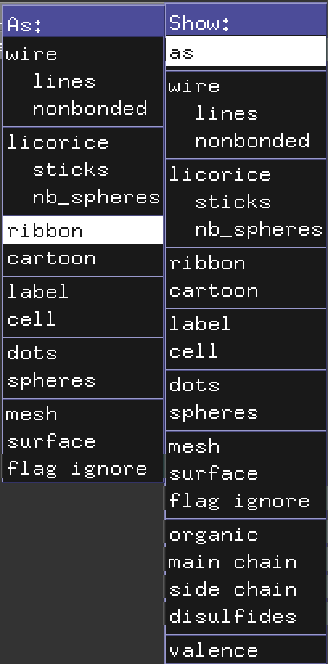

# Домашнее задание 5

**Название ПО**: PyMOL

**Структура белка**: [RCSB PDB - 1A9W](https://www.rcsb.org/structure/1A9W)

## Визуализация

### Wireframe

|  |  |
| -------------------------------------------- | -------------------------------------------- |

### Backbone

|  |  |
| ------------------------------------------ | ------------------------------------------ |

### Spacefill

|  |  |
| -------------------------------------------- | -------------------------------------------- |

### Ribbons

|  |  |
| ---------------------------------------- | ---------------------------------------- |

### Molecular Surface

|  |  |
| ---------------------------------------- | ---------------------------------------- |

## Раскраска

### Цветовая модель CPK

|  |  |
| -------------------------------- | -------------------------------- |

### По доменам белка

|  |  |
| ---------------------------------------- | ---------------------------------------- |

## Изображение публикационного качества

