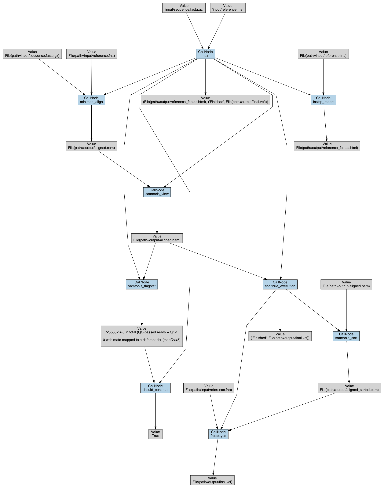

# Bioinformatic Assignment

## Инструкция по запуску

1. Создать в корне репозитория папку `bin` и поместить в неё необходимые зависимости: FastQC, Minimap2, SAMtools, FreeBayes. Скомпилированные версии зависимостей для macOS x64 можно найти в релизах репозитория.

2. Запустить следующую последовательность команд:
   ```shell
   python3 -m venv .venv
   source .venv/bin/activate
   python3 -m pip install "redun[viz]"
   redun run pipeline.py main
   ```
В результате выполнения пайплайна будет создана папка `output`, содержащая полученные файлы (также приложена в релизах). Лог пайплайна будет выведен в `stdout`, но его можно перенаправить в любой другой файл.

## Визуализация

Для визуализации использовались встроенные возможности библиотеки `redun`. Для генерации графа нужно запустить команду `redun viz <exec-id>`, где `exec-id` может быть получен из лога запуска пайплайна.

В отличие от блок-схемы представленной в задании, данная визуализация отображает только фактически исполненную ветку (после проверки условия > 90%). Кроме того, вершины каждой задачи имеют дополнительное входное ребро из задачи main.

